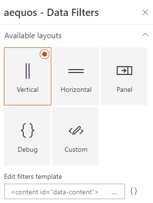

## Builtin layouts

By default, the following layouts are provided:

{: .center}

### Vertical

{!basic/usage/data-filters/layouts/vertical.md!}

### Horizontal

{!basic/usage/data-filters/layouts/horizontal.md!}

### Panel

{!basic/usage/data-filters/layouts/panel.md!}

### Debug

{!basic/usage/data-filters/layouts/debug.md!}

### Custom

{!basic/usage/data-filters/layouts/custom.md!}

