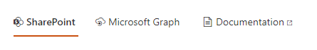

# Data Verticals Web Part

The 'Data Verticals' Web Part allows to conditionally render a 'Data Visualizer' Web Part according to the selected vertical. It is a simple way to build a complete search center including multiple sources.

{: .center}

{: .center} 

## Configuration

The configuration of the 'Data Verticals' Web Part is fairly simple.

{: .center} 

The options for a vertical are as follow:

| **Setting** | **Description** |
|------------|-----------------|
| **Tab Name** | The vertical name (i.e. tab) 
| **Office UI Fabric icon name** | The optional Office UI fabric icon to display for the tab. Refer to [Office UI Fabric documentation](https://developer.microsoft.com/en-us/fluentui#/styles/web/icons) to see all available icons.
| **Is hyperlink** | If checked, the tab will behave as an hyperlink meaning it won't trigger any selected event.
| **Link URL** | If the tab is an hyperlink, the link URL to use. Tokens `{<TokenName>}` are supported here. See [tokens](../data-visualizer/tokens.md) for more info.
| **Open behavior** | If the tab is an hyperlink, the opening behavior (new tab or current tab).

> The 'Data Verticals' Web Part does not need to be connected to any Web Part. However, it is meant to be used by a 'Data Visualizer' Web Part to get it work. More info about configuration [here](../data-visualizer/connections/index.md).