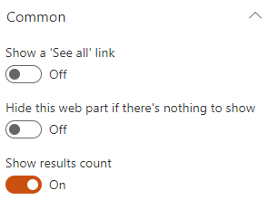

## Builtin layouts

By default, the following layouts are provided:

{: .center}

> Be careful, when you switch the layout in the property pane, all the previous layout properties are lost. We do this to avoid polluting the Web Part property bag with multiple useless configurations.

### Cards

{!basic/usage/data-visualizer/layouts/cards.md!}

### Details List

{!basic/usage/data-visualizer/layouts/details-list.md!}

### Slider

{!basic/usage/data-visualizer/layouts/slider.md!}

### Simple list

{!basic/usage/data-visualizer/layouts/simple-list.md!}

### People

{!basic/usage/data-visualizer/layouts/people.md!}

### Debug

{!basic/usage/data-visualizer/layouts/debug.md!}

### Custom

{!basic/usage/data-visualizer/layouts/custom.md!}

## Common settings

For all layouts, some common settings are available:

{: .center}

| Setting | Description | Default value 
| ------- |---------------- | ---------- |
| **Show a 'See all' link** | Allows you to specify a 'See all' link at the top right of the Web Part along the Web Part title. You can set the text that will appear plus the link to use. Tokens are supported in the link URL. 

 | Disabled.
| **Hide this web part if there's nothing to show** | If there is no results, the Web Part will remain blank in display mode (title and 'See all' link included). In edit mode, you will see a message indicating there is no results. 

 | Disabled.
| **Show results count** | Hide or display the results count for the current query. | Enabled.

