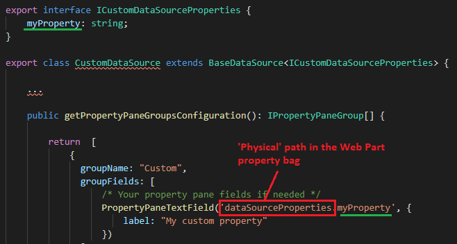

# Create a custom data source

{: .center}

## Data source creation process

Data source creation process comes in two distinct steps:

1. [Create the data source itself (i.e. the logic to get data, etc.)](#create-the-data-source-logic).
2. [Register the data source information for discovery](#register-data-source-information).

### Create the data source logic

The first step is to create the core logic of the data source:

* In your extensibility library project, create a new `MyDataSource.ts` TypeScript file.
* Create an interface for your data source properties, typically the ones you want to persist in the Web Part property bag. Data source properties are isolated from the other general Web Part properties under the property `dataSourceProperties` in the property bag object.
```typescript
    export interface ICustomDataSourceProperties {
        myProperty: string;
    }
```

{: .center}

* Implement the `BaseDataSource` abstract class using your properties interface:
```typescript
    export class CustomDataSource extends BaseDataSource<ICustomDataSourceProperties> {
        ...
    }
```

* Implement your data source logic according to the available methods and properties.

#### BaseDataSource - Methods

| Method | Description |
| --------- | ---------- |
| `onInit()`| The initialization method of your data source (ex: initialize your properties, etc.). You can perform asynchronous calls here. This method will be called when the data source is instanciated by the main Web Part.
| `getData()` | Probably the most important method in a data source. Returns the data of your data source, for instance, after an asynchronous call to your API. The data must follow the `IDataSourceData` interface. As input, you will receive all the data context with useful information to get your data (ex: the current selected page, current selected filters, etc.).
| `getPropertyPaneGroupsConfiguration()` | Returns the property pane fields to display when your data source is selected. These are regular SPFx property fields and groups. Data source properties are isolated from the other general Web Part properties under the property `dataSourceProperties`. It means you must include that path in your property pane controls get the value persisted: </br> <p align="center"></p>. Defining fields or groups is not mandatory for a data source. If you don't want to expose any option, just return an empty array.
| `getPagingBehavior()` | The paging behavior of the data source. If **'Dynamic'**, the paging will be done using the pre-calculated `paging.links` array property returned by the data source. In this mode, this is your responsibility to populate these links (ex: using a `@odata.nextLink` information from your API). If **'Static'**, the paging will be done statically based on the `items` array property returned by the data source. If **'None'**, no paging will be performed.
| `getFilterBehavior()` | The filter behavior of the data source. If **'Dynamic'**, the available filters and values will be the ones returned by the data source in the `filters` array property. If **'Static'**, the available filters and values will be determined using the current results set returned by the data source (using objects properties from the `items` array property).
| `getAppliedFilters()` | If any, returns the list of filters (i.e data source fields) applied by the data source to filter results. Set this information in your data source is `FilterType.Static` but you still want filter initial result with 'Static' filters (like Taxonomy Picker and Date Range). These will be excluded by the main Web Part during the static filtering operation. If you forgot to set these values, data will be filtered statically using the current selected filters.
| `getItemCount()` | Returns the total of items. This can be the `items` array length or the total of items in general. This information will be used to generate page numbers.
| `getTemplateSlots()` | Returns the available template slots for this data source. [More information about slots](../usage/data-visualizer/slots.md).
| `onPropertyUpdate()` | The method will be called when a property pane value is updated. The main Web Part in `Reactive` mode for property pane fields.
| `render()` | Call this method to force a render of the main Web Part.

#### BaseDataSource - Properties

| Property | Description |
| --------- | ---------- |
| `properties`    | The Web Part properties in the property bag. Corresponds to the isolated `dataSourceProperties` property in the global property bag. You won't be able to access any other general properties of the Web Part.
| `context` | The Web Part context given by the main Web Part.
| `serviceKeys` | The available service scope keys you can use to get shared service instances like the `TokenService`. Example: </br> <p align="center"></p>


#### Using service scope to get service instances

If your data source needs to use `SPHttpClient`, `HttpClient`, etc. services to retrieve data, you have multiple ways to get instances for these.

* Use the `this.context` property:

```typescript
    const spHttpClient = this.context.spHttpClient;
```
**OR**

* Use the parent service scope to consume an existing instance:
```typescript
    private spHttpClient: SPHttpClient;

    constructor(serviceScope: ServiceScope) {
    
        super(serviceScope);

        serviceScope.whenFinished(() => {
            this.spHttpClient = serviceScope.consume(SPHttpClient.serviceKey);
        });
    }
```

> We recommend to use the second approach especially if you also use shared instances like the `TokenService`.

### Register data source information

The next step is to fill information about your new data source. In the library main entry point (i.e. the class implementing the `IExtensibilityLibrary` in interface) return a new `IDataSourceDefinition` object in the `getCustomDataSources()` method using these properties: 

| Property | Description |
| --------- | ---------- |
| `name` | The friendly name of your data source that will show up in tiles.
| `iconName` | An Office UI Fabric icon for your data source.
| `key` | An unique internal key for your data source.
| `serviceKey` | A service key used to instanciate your data source class. Builtin or custom data sources are instanciated dynamically using [SPFx service scopes](https://docs.microsoft.com/en-us/javascript/api/sp-core-library/servicescope?view=sp-typescript-latest).

```typescript
  public getCustomDataSources(): IDataSourceDefinition[] {

    return [
      {
          name: 'My Custom Source',
          iconName: 'Code',
          key: 'CustomDataSource',
          serviceKey: ServiceKey.create<IDataSource>('MyCompany:CustomDataSource', CustomDataSource)
      },
    ];
  }
```
