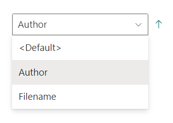
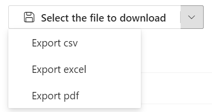

# Builtin web components

Here are the list of all **reusable** web components you can use to customize your templates. 

- &lt;aequos-iconfile&gt;
- &lt;aequos-documentcard&gt;
- &lt;aequos-filepreview&gt;
- &lt;aequos-icon&gt;
- &lt;aequos-panel&gt;
- &lt;aequos-collapsible&gt;
- &lt;aequos-persona&gt;
- &lt;aequos-sortfield&gt;

!!! info
    All other web components you will see in builtin layout templates are considered **internal** and are not supported for custom use.

    All components have an optional `data-theme-variant` attribute used to set the theme for your internal React components (for instance using Office UI Fabric). This value is typically retrieved from the root Handlebars context and reflect the current **section theme** where the Web Part belongs. **If not set, the theme of current site will be used as fallback and may not corespond to the current section theme**.

## Icon file

!!! example
    === "Description"

        Render a file icon according to an extension. 
        {: .center}

    === "Usage"

        ```html
        <aequos-iconfile 
            data-extension="docx" 
            data-is-container="false" 
            data-size="32">
        </aequos-iconfile>
        ```

        | Parameter | Description |
        | --------- | ----------- |
        |**data-extension**|The file extension to render.
        |**data-is-container**|If `true` or `1`, the icon will be a folder.
        |**data-size**|The size of the icon to display.

## Document card

!!! example
    === "Description"

        Render a document card.

        {: .center}

    === "Usage"

        ```html
        <aequos-documentcard 
            data-location="&lt;a href=\&quot;https://...\&quot;&gt;Title&lt;/a&gt;"
            data-title="Title"
            data-preview-image="https://..." 
            data-preview-url="https://..." 
            data-date="01/01/2020" 
            data-href="https://..." 
            data-author="David Lopez" 
            data-profile-image="/_layouts/15/userphoto.aspx?size=L&username=david.lopez@contoso.com" 
            data-file-extension="docx"
            data-enable-preview="true" 
            data-is-container="false"
            data-show-file-icon="true">`
        </aequos-documentcard>
        ```

        | Parameter | Description |
        | --------- | ----------- |
        |**data-location**|The document card location. HTML is allowed here. You must encode the string for this scenario.
        |**data-title**|The document card title.
        |**data-preview-image**|The preview image URL for the card.
        |**data-preview-url**|The preview URL for the card.
        |**data-href**|The URL for the card title.
        |**data-author**|The author to display.
        |**data-profile-image**|The profile image URL for the author if any.
        |**data-file-extension**|The document card file extension if any.
        |**data-enable-preview**|If the card supports preview. If `true`, a preview URL + preview image URL should be set.
        |**data-is-container**|If `true` or `1`, the file icon will be a folder icon.
        |**show-file-icon**|If `true` or `1`, the file icon will be hidden/displayed.

## File preview

!!! example
    === "Description"

        Render file preview in a callout when the wrapped element **is clicked**. The wrapped element can be anything (text, image, etc.)

        {: .center}

    === "Usage"

        ```html
        <aequos-filepreview 
            data-preview-url="https://..." 
            data-preview-image-url="https://...">
            <span>Wrapped element</span>
        </aequos-filepreview>
        ```

        | Parameter | Description |
        | --------- | ----------- |
        |**data-preview-image**|The preview image URL for the callout displayed while the preview is loading in a iframe (optional).
        |**data-preview-url**|The preview URL for the element in the callout.
    
## Icon

!!! example
    === "Description"

        Display an [Office UI Fabric icon](https://developer.microsoft.com/en-us/fluentui#/styles/web/icons).

        {: .center}

    === "Usage"

        ```html
        <aequos-icon data-name="Tag" aria-hidden="true"></aequos-icon>
        ```

        | Parameter | Description |
        | --------- | ----------- |
        |**data-name**|The Office UI Fabric icon name to display (case sensitive).
    
## Panel

!!! example
    === "Description"

        Display a panel with (`panel-content`) content when the associated outer `panel-open` element is clicked.

        {: .center}

    === "Usage"

        ```html
        <aequos-panel   
            data-state-key="{{@root.instanceId}}"
            data-disable-animation="true"
            data-is-light-dismiss="true"
            data-is-blocking="true"
            data-size="2"
            data-panel-header-text="Panel header!">

            <template id="panel-open">
                <!-- All the content here will be wrapped with an onclick event opening/hiding the panel -->

                Click me!
            </template>

            <template id="panel-content">
                <!-- Panel content goes here -->
            
                Panel content!
            </template>
            
        </aequos-panel>
        ```

        | Parameter | Description |
        | --------- | ----------- |
        |**data-state-key**| An unique ID for the panel component. This value is used to store the current open state. You can use any value here or a unique ID coming from the contexte like `{{@root.instanceId}}`
        |**data-disable-animation**| Disable the panel opne/close animation.
        |**data-is-light-dismiss**| If `true`, dismiss the panel when the user clicks outside of the panel area.
        |**data-is-blocking**| If `true`, the modal show as modal.
        |**data-size** | The size of the panel. See [Office Fluent UI](https://docs.microsoft.com/en-us/javascript/api/react/paneltype?view=office-ui-fabric-react-latest) for valid values.
        |**data-theme-variant** | The current Microsoft 365 them. Itended to work with `{{JSONstringify @root.theme}}`.
        |**data-panel-header-text** | The header text in the panel.

!!! important
    Since release **1.3.0** the parameter `data-is-open` is deprecated.

## Collapsible

!!! example

    === "Description"

        Expand/collapse the `collapsible-content` content when the text with `data-group-name` is clicked.

        {: .center}

    === "Usage"

        ```html
        <aequos-collapsible 
            data-group-name="Collapsible content" 
            data-default-collapsed="true">

            <template id="collapsible-header">
                <div>
                    My header!
                </div>
            </template>

            <template id="collapsible-content">
                <div>
                    My Content!
                </div>
            </template>

            <template id="collapsible-footer">
                <div>
                    My Footer!
                </div>
            </template>

        </aequos-collapsible>
        ```

        | Parameter | Description |
        | --------- | ----------- |
        |**data-default-collapsed**|If the content should be collapsed by default `true/false`.
        |**data-group-name** |The header group name for expand/collapse.

## Persona card

!!! example

    === "Description"

        Display a persona item with relevant information.

        {: .center}

    === "Usage"

        ```html
        <aequos-persona
            data-image-url="/_layouts/15/userphoto.aspx?size=L&username=david.lopez@contoso.com"
            data-primary-text="David Lopez"
            data-secondary-text="Unknown"
            data-tertiary-text=""
            data-optional-text="514 928 0000"
            data-persona-size="" >
        </aequos-persona>
        ```

        | Parameter | Description |
        | --------- | ----------- |
        |**data-image-url**|The persona image URL.
        |**data-primary-text**|The primary text (ex: person display name).
        |**data-secondary-text**|The secondary text to display (ex: job title).
        |**data-tertiary-text**|The tertiary text to display (ex: work phone).
        |**data-optional-text**|The optional text to display.
        |**data-persona-size**|The size of the persona **item** to display (no only the picture). Valid values are <ul><li>tiny = 0</li><li>extraExtraSmall = 1</li><li>extraSmall = 2</li><li>small = 3</li><li>regular = 4</li><li>large = 5</li><li>extraLarge = 6</li></ul>

## Sort Field

!!! example
    === "Description"

        Render a sort dropdown to sort the data results. 
        {: .center}

    === "Usage"

        ```html
        <aequos-sortfield 
            data-fields='["Author","Filename"]' 
            data-default-selected-field="Author" 
            data-default-direction="1">
        </aequos-sortfield>
        ```

        | Parameter | Description |
        | --------- | ----------- |
        |**data-fields**|The array of Sort fields.
        |**data-default-selected-field**| The default sort field.
        |**data-default-direction**|If `1`, the default direction will be ascending, if `2`, it will be descending.
        |**data-theme-variant**| The current Microsoft 365 theme. Itended to work with {{JSONstringify @root.theme}}.


    === "Limits"

        For SharePoint and Microsoft data sources, only below Sortable fields are allowed.

        'AADObjectID',
        'Author',
        'ClassificationLastScan',
        'ClickStreamClickedCount',
        'ClickStreamLastClickCount',
        'ClickStreamSkippedCount',
        'ClickStreamSkippedCount',
        'CommunityMembersCount',
        'CommunityRepliesCount',
        'CommunityTopicsCount',
        'ComplianceTag',
        'ComplianceTagWrittenTime',
        'Created',
        'DMSDocAccessRight',
        'DMSDocAuthor',
        'DMSDocTitle',
        'DetectedLanguageRanking',
        'DocumentAnalyticsLastActivityTimestamp',
        'DocumentAnalyticsLastActivityTimestamp',
        'EndDateOWSDATE',
        'EventDateOWSDATE',
        'EventRate',
        'EventsRollUpEndDate',
        'EventsRollUpStartDate',
        'ExpirationTime',
        'FileExtension',
        'Filename',
        'FirstName',
        'FirstPublishedDate',
        'IRMProtected',
        'IRMTemplateName',
        'InboundLinkCount',
        'IsExternalContent',
        'LastModifiedTime',
        'LastModifiedTimeForRetention',
        'LastName',
        'LevelsToTop',
        'ModifiedBy',
        'ModifierAADIDs',
        'NonWordBrokenComplianceTag',
        'ProductCatalogGroupNumberOWSTEXT',
        'PromotedState',
        'QLogClicks',
        'QLogLastClicks',
        'QLogSiteClicks',
        'QLogSiteLastClicks',
        'QLogSiteSkips',
        'QLogSkips',
        'RecentViewCount',
        'RecentViewCount',
        'RecsClickedLifeTime',
        'RecsClickedRecent'.        

## Export Results

!!! example
    === "Description"

        Render an export dropdown to download the data results.
        {: .center}

    === "Usage"

        ```html
                    <aequos-export 
                        data-columns-configuration="[{name: 'Title', value: 'Title', useHandlebarsExpr: true},{name: 'Created', value: 'Created', useHandlebarsExpr: true}]"
                        data-data-source-key="SharePointSearch"
                    >
                    </aequos-export>        
        
        ```

        | Parameter | Description |
        | --------- | ----------- |
        |**data-columns-configuration**|The array of Export fields.
        |**data-data-source-key**| The data source key.