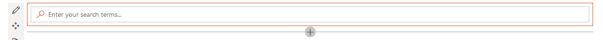
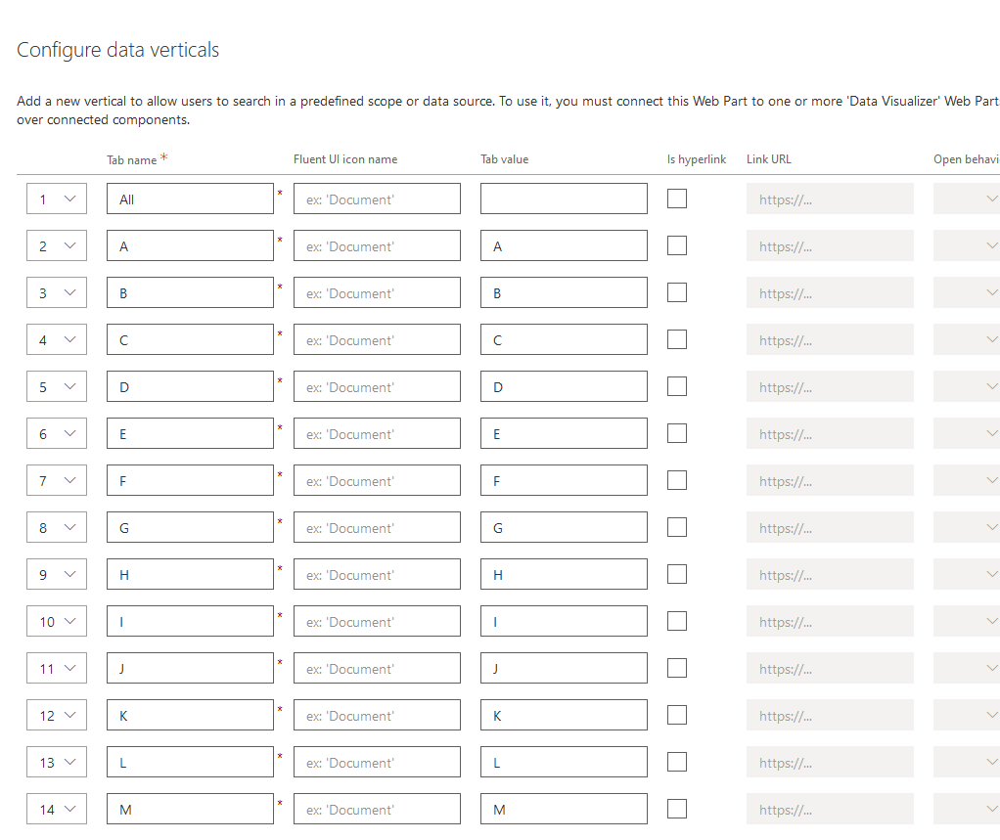
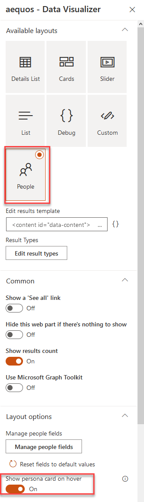
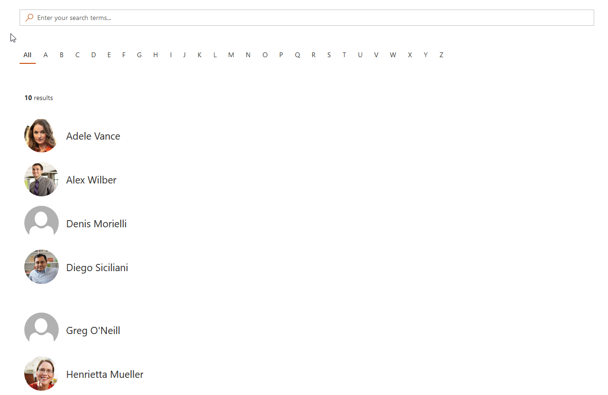

# Build a people directory using alphabetical verticals, SharePoint Search data source and adaptive expressions

A classic use case in a SharePoint portal. This time, instead of using the SharePoint search data source, we use the Microsoft Graph and the [People API](https://docs.microsoft.com/en-us/graph/people-example#search-people) to lookup relevant people based on search box Web Part input keywords. We also add alphabetical filters as verticals and take advantage of the adaptive expressions feature to write a dynamic query.  

## Video tutorial

<iframe width="560" height="315" src="https://www.youtube.com/embed/mz76r7gcsQU" frameborder="0" allow="accelerometer; autoplay; clipboard-write; encrypted-media; gyroscope; picture-in-picture" allowfullscreen></iframe>

## Step-by-step tutorial

1. Add the _'Search Box'_ Web Part on the page.

    {: .center} 

1. Add the _'Data Verticals'_ Web Part on the page.

    {: .center} 

1. For each alphabetical letter, add and configure a new vertical. As the value use `<Letter>`. Example `A` for letter **'A'**. You can also add an **'All'** tab with an empty value.

    {: .center} 

    {: .center} 

1. Add a new _'Data Visualizer'_ Web Part on the page.

    {: .center} 

1. Select the _'OData'_ data source and then _'Microsoft Graph'_.

    {: .center}

1. Enter the following query and press _'Apply'_: 

    ```
    https://graph.microsoft.com/v1.0/users?$top={itemsCountPerPage}&$count=true${if(empty('{inputQueryText}'),'','&$search="displayName:{inputQueryText}"')}${if(empty("{verticals.value}"),'',"&$filter=startsWith(displayName,'{verticals.value}')")}
    ```

    **Explanations:**

    - `https://graph.microsoft.com/v1.0/users`: Microsoft graph endpoint to retreive users from Azure Active Directory.
    - `?$top={itemsCountPerPage}`: Limits the number of results dynamically according the the number configured in the Web Part (`{itemsCountPerPage}`).
    - `&$count=true`: Returns the number of total results for the query (not the same as the current number of displayed results).
    - `${if(empty('{inputQueryText}'),'','&$search="displayName:{inputQueryText}"')}`: Adaptive expression to conditionally add the `search=` parameter if the input query text is not empty. Making a request with an empty text will fail otherwise. This conditions is here to cover the **All** scenario in verticals tab.
    - `${if(empty("{verticals.value}"),'',"&$filter=startsWith(displayName,'{verticals.value}')")}`: Adaptive expression to conditionally filter on the current selected vertical tab value if present (for instance when _'A'_ is selected, only filter users with the display name starts with _'A'_).

1. In the _'Headers'_ option, add the value `"ConsistencyLevel": "eventual"` to HTTP headers. This is needed by the Microsoft Graph API to get the count correctly:

    {: .center}

1. In the _'Connections'_ property pane configuration page

    - Connect the _'Search Box'_ Web Part:

        {: .center}

    - Connect the _'Data Verticals'_ Web Part previously added. Select **all** the available tabs (i.e. letters). Basically it tells the Data Visualizer Web Part to be or remain visible when user clicks on any of these letters.

        {: .center}

1. In _'Layouts'_ property pane configuration page, select the 'People' layout.

    {: .center}

    > Optionally, in the layout options, you can check _'Show persona card on hover'_ option. To get it work, [an administrator needs to approve required API permissions](../../installation).


1. Save your page. You can now filter people based on alphabetical letters using their first name or view all users.

    {: .center}