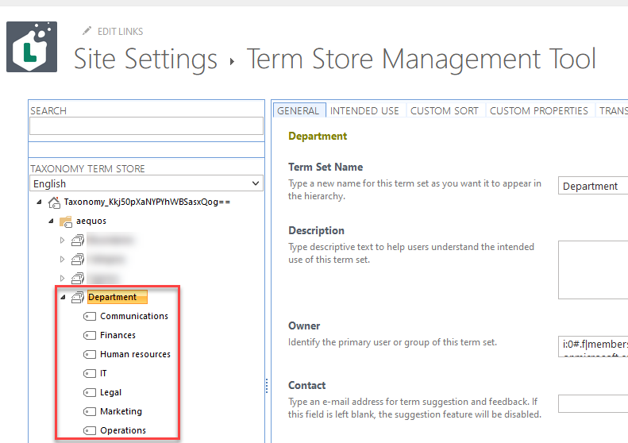
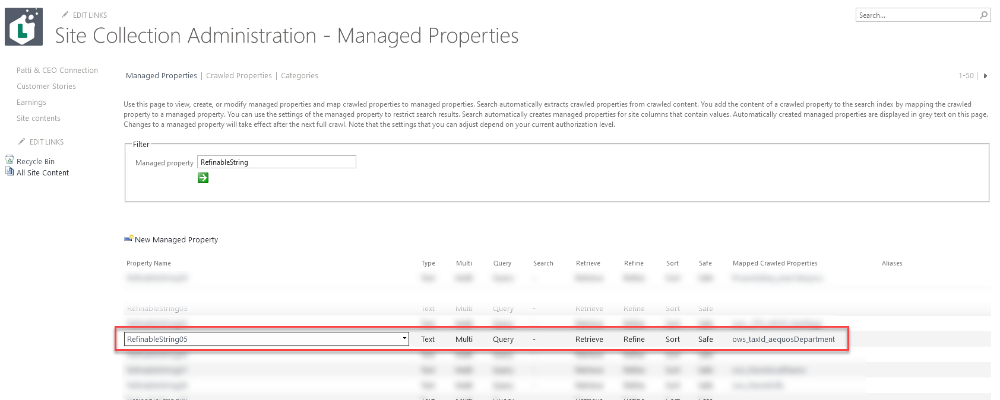
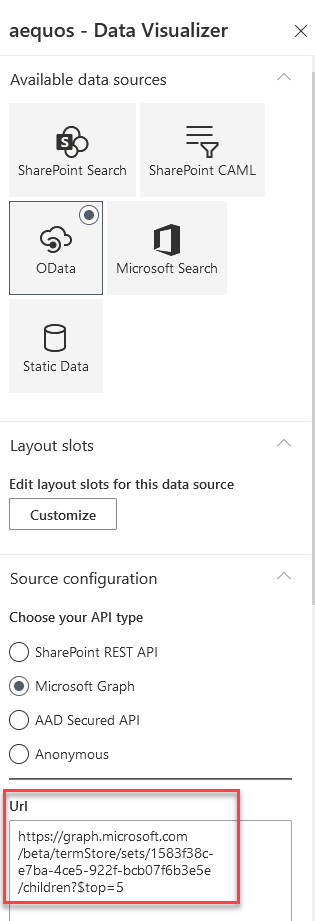
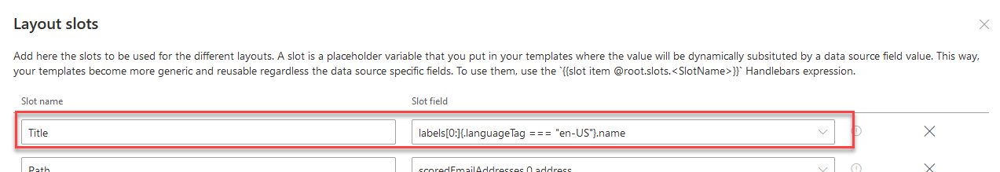
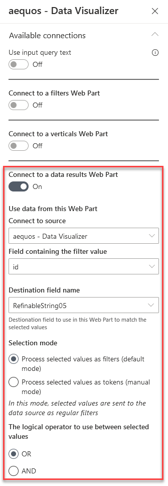
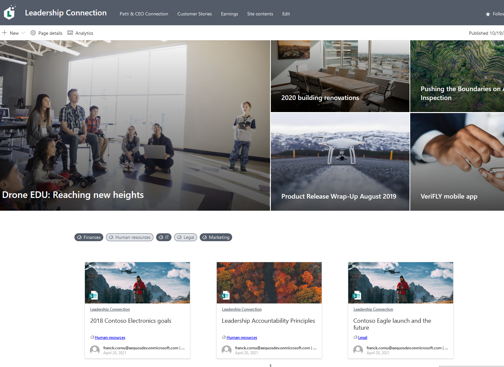

# Build taxonomy tag filters bar using Data Visualizer Web Part item selection capability

This tutorial shows you how to build a tag filters bar based on SharePoint taxonomy to quickly filter your content dynamically without the need of the Data Filters Web Part. As an example and to showcase the item selection feature, we will build a news carousel filterable by managed metadata tags on an intranet home page.

{: .center}

!!! note
    The connection between Data Visualizer Web Parts is only available from the **1.4.0** version.

## Setup SharePoint site

1. On a SharePoint site, create some news pages and classify them with a managed metadata column (ex: _"Department"_):

    {: .center}

    {: .center}

    !!! note
        Don't forget to publish your news to get them indexed by the SharePoint search engine.

2. At site collection level, create a search managed property based on this managed metadata column (ex: _"RefinableString05"_):

    {: .center} 

    !!! note
        Use the `ows_taxId_<column_name>` format for the mapped search crawled property.

## Configure Web Parts

1. On a SharePoint page, add a new Data Visualizer Web Part to lookup the site news with the following configuration:

    - **Data source**: SharePoint Search with query template `Path:{site.absoluteUrl}/SitePages/news IsDocument:1`. This will get only the site news of the current site.

    {: .center} 

    - Enable the **Enable localization** option on the first Web Part configuration page.
    - In the slots configuration, for the _'Tags'_ slot, use the `Auto` prefix + your search managed property name or alias created earlier (ex: `AutoRefinableString05`). Press _'Enter'_ to validate the value.

    {: .center} 

    Using the default _'Cards'_ layout, you should see something like this:

    {: .center} 
    

2. On the same page, add a second Data Visualizer Web Part above the first one with the following configuration:

    - **Data source**: OData (Microsoft Graph) with the following URL `https://graph.microsoft.com/beta/termStore/sets/<your_term_set_id>5e/children?$top=5`. 

    {: .center} 
    
    You must replace `<your_term_set_id>` with the id of the taxonomy term set used to classify the news:

    {: .center} 

    !!! note
        To get it work, the `TermStore.Read.All` Microsoft Graph permission should be approved at tenant level.

    - In the slots configuration, for the _'Title'_ use the following value `labels[0:]{.languageTag === "en-US"}.name`. Press 'Enter' to validate. This will get only label for the English language as item title.

    {: .center}

    - **Layouts**: use the _'Custom'_ layout option with the [following filter template .html content](./assets/tags_bar_template.html) (open the webpage source code in your browser to access the content).

    - In the 'Common' section of the layout page configuration, allow the item selection:

    {: .center}

    You should see your taxonomy terms like this:

    {: .center}

3. Go back to the first Data Visualizer Web Part displaying the news and go to the third configuration page regarding connections. Configure the connection with the other Data Visualizer like this:

    {: .center}

4. Save the page. You can now filter news dynamically based on taxonomy tags dynamically!

    {: .center}

    !!! note
        If you allowed multi items selection, you must use `CTRL` + `Left click` to select multiple elements. You can also select a range of elements using `SHIFT` + `Left click`.

