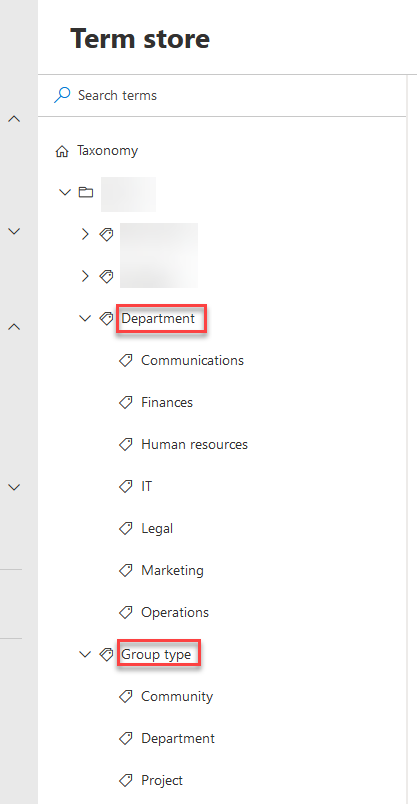
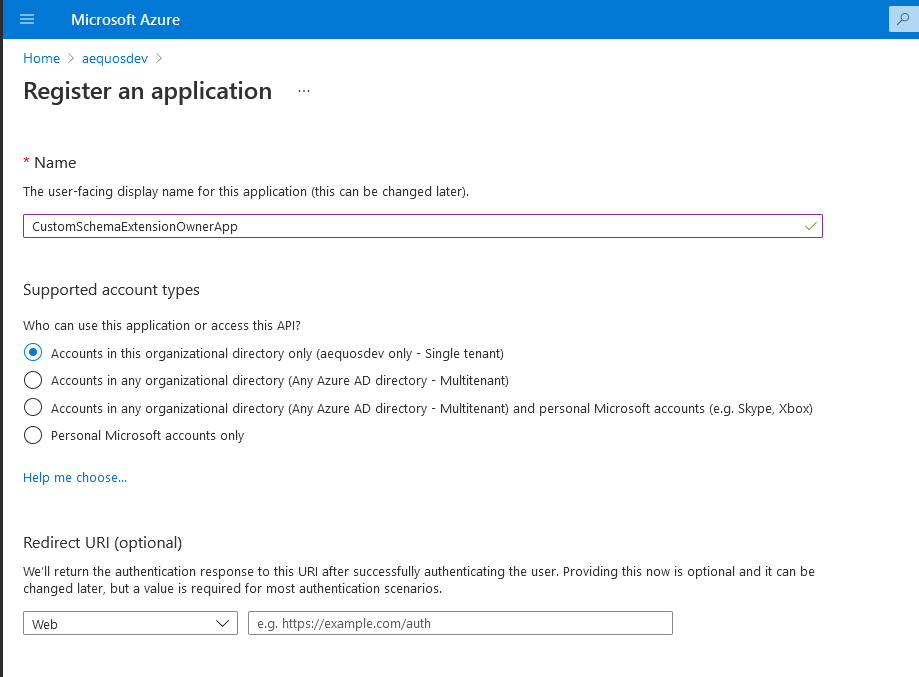
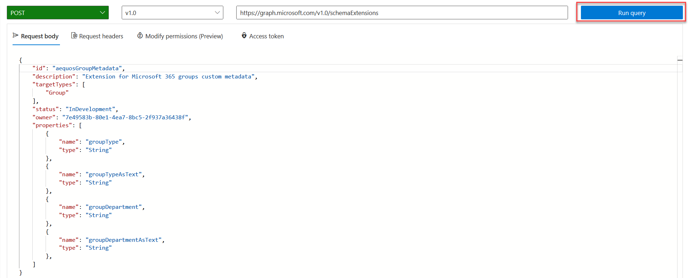
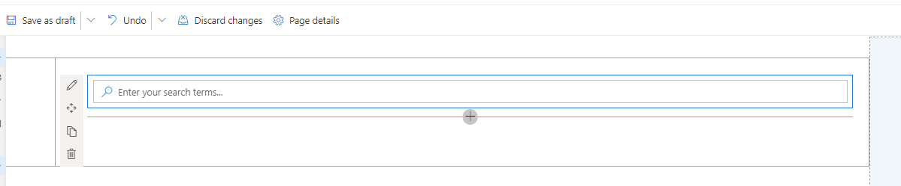
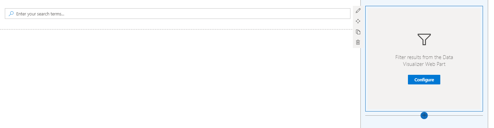
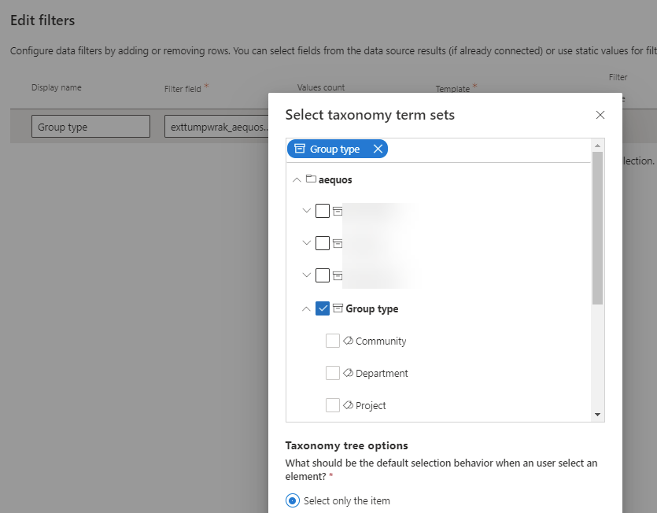
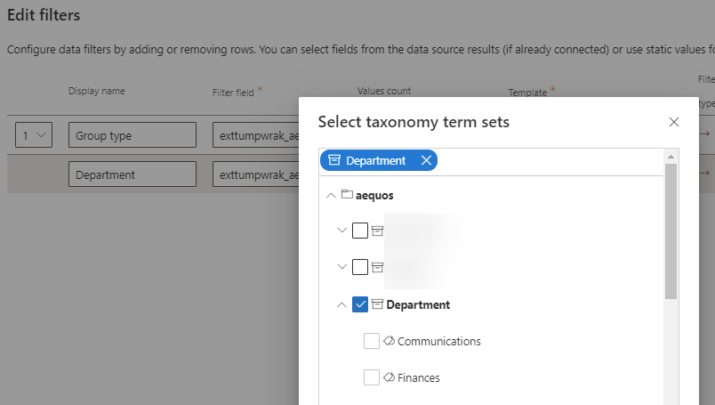
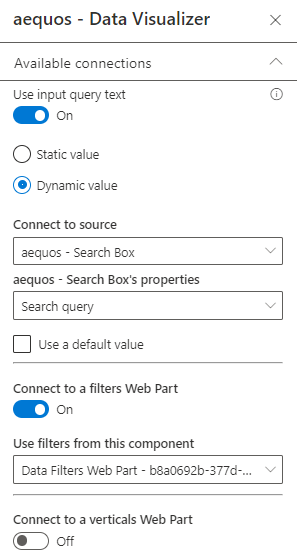
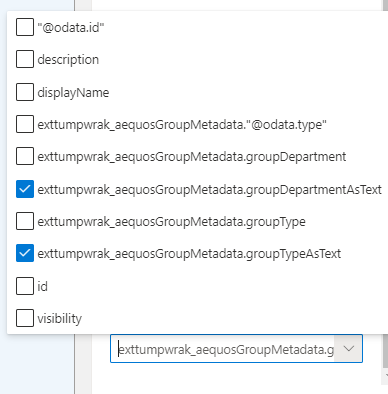

# Build a teams search app using aequos MDV, Microsoft Graph extensions, and SharePoint taxonomy

Recently, we had a customer. Because the Modern Data Visualizer was a perfect fit for its requirement:

- Creating a search interface only for Teams
- Packing to a Teams applications so users can access their Teams directly through the Teams client

In this tutorial, we will cover how to build a search center for levering the aequos Modern Data Visualizer solution, Microsoft Graph schema extensions, and SharePoint taxonomy.

Why classify teams?

The common approach would be to maintain a SharePoint list mapping existing Teams and use taxonomy columns to it, then use traditional SharePoint search to filter. The downside of this approach is you have to maintain this synchronization and don't have live results. 

Inconvenient of the Teams application (web or desktop):

- Can't add custom metadata in the deskt. The only filter is by name or description
- Display and filter experience poor performances can be very slow when the user is a member of several Teams

Technologies used:

- Microsoft Graph schema extensions
- SharePoint taxonomy
- aequos Modern Data Visualizer solution

1. Create taxonomy term sets

For this example, we create two SharePoint taxonomy term sets for our Teams classification:

- _"Group type"_: the type of Team created (Project, Community, Organizational)
- _"Department"_: the organization department associated with the group

    {: .center}

## 1. Create Microsoft Graph schema extension

To be able to set custom metadata for your Teams, you will need first to create a Microsoft Graph schema extension on the underlying `group` resource. Microsoft Graph extensions are a way provided by Microsoft to add custom data on Microsoft 365 resources (ex: `group`, `user`, etc.)

**_Why using a schema extension instead of an open extension?_**

> Simply because only schema extension can be filtered using the OData `$filter` expression. To build a search center, this could be useful ;).

!!! warning
    As of today, Microsoft Schema extensions [does not support complex property types like arrays](https://docs.microsoft.com/en-us/graph/api/resources/extensionschemaproperty?view=graph-rest-1.0) and string values are limited to 256 characters. It means it only works with single value fields. 

### Create a schema extension using Microsoft Graph explorer

- In the same Azure tenant where the Teams you want to tag belong, create a blank Azure AD application and save its ID for later. 

    !!! info
        There is no need to configure any permissions for this application.

    {: .center}

    {: .center} 

> To be able to create a schema extension in Microsoft Graph, you need to "prove" you actually own a tenant to use it. This is done by providing a unique ID of an Azure AD application in your Active Directory at extension creation time (in the `owner` property). This application doesn't need to do more than just exist in the tenant.

- Open the [Microsoft Graph explorer](https://aka.ms/ge) and connect with a Microsoft 365 global administrator account
- In the URL input enter `https://graph.microsoft.com/v1.0/schemaExtensions` and `POST` for the HTTP method
- On the **'Modify permissions'** tab, consent to the listed permissions:

    {: .center}

- In the **'Request body'** tab, use the following body payload with your information and press **'Run Query'**:

```json
{
    "id": "aequosGroupMetadata", // Your extension name
    "description": "Extension for Microsoft 365 groups custom metadata",
    "targetTypes": [
        "Group"
    ],
    "status": "InDevelopment",
    "owner": "7e49583b-80e1-4ea7-8bc5-xxxxxxxxx", // Replace with your own Azure AD application ID 
    "properties": [
        {
            "name": "groupType",
            "type": "String"
        },
        {
            "name": "groupTypeAsText",
            "type": "String"
        },
        {
            "name": "groupDepartment",
            "type": "String"
        },
        {
            "name": "groupDepartmentAsText",
            "type": "String"
        },
    ]
}
```

{: .center}

- You should see the HTTP response like this:

    {: .center}

    !!! important
        When you create your extension for the first time, you need to save its generated id **as you won't be able to retrieve it afterward**. Microsoft Graph extensions are shared across all tenants worldwide (only the definition, not values) so it will be very hard to get this value again.

## 2. Tag your Teams with your new extension and taxonomy values

As you probably want to tag not just one Team in your organization, this step can be automated using multiple ways ex: (process a CSV file with PowerShell or use a custom business application). In this sample, we will just show how to tag a single team using Graph Explorer. The concept remains the same for multiple teams. 

- In the Microsoft Graph Explorer, get the list of your Teams using the `https://graph.microsoft.com/beta/groups?$filter=resourceProvisioningOptions/Any(x:x eq 'Team')` URL (GET) and choose one in the list you want to tag saving its `id`:

{: .center}

- In Graph Explorer, using this ID, update the group with the SharePoint taxonomy term values. As a convention, we will use the SharePoint taxonomy term IDs as the main extension properties value and the term labels for the `'AsText'` properties:

{: .center}

!!! info
    The `'AsText'` are mainly here for performances purpose as it avoids fetching the label again for the taxonomy ID in the Web Part layout.  

## 3. Build a SharePoint search page using the Modern Data Visualizer Web Part

In a SharePoint modern site (communication or team site), create a new page using the _'Home'_ layout. This can be achieved by using the following [PnP PowerShell](https://pnp.github.io/powershell/cmdlets/Add-PnPClientSidePage.html) cmdlets:

```PowerShell
Connect-PnPOnline -Url https:/<your_site_url> -UseWebLogin
Add-PnPClientSidePage -LayoutType Home -Name teams-search-mdv -CommentsEnabled:$false
```

or by using the following [CLI for Microsoft 365](https://pnp.github.io/cli-microsoft365/cmd/spo/page/page-set/) commands:

```bash
m365 login
m365 spo page add --name teams-search-mdv.aspx --webUrl https:/<your_site_url> --layoutType Home
```

> We use this layout for convenience as it fits well to build search pages.

- Add needed Graph permissions for the Modern Data Visualizer SPFx Web Parts. This can be achieved using [Microsoft 365 CLI](https://pnp.github.io/cli-microsoft365/) and the following commands:

```bash
m365 login
m365 spo serviceprincipal grant add --resource 'Microsoft Graph' --scope 'GroupMember.Read.All'
m365 spo serviceprincipal grant add --resource 'Microsoft Graph' --scope 'Channel.ReadBasic.All'
m365 spo serviceprincipal grant add --resource 'Microsoft Graph' --scope 'User.Read'
```

- Go and edit the newly created page and change the layout to be 'Vertical section':

{: .center}

- On the main zone, add a _Search Box Web Part_:

{: .center}

- On the right zone, add a _Data Filters Web Part_ with the following configurations:

{: .center}

!!! example "Data Filters Web Part configuration"

    {: .center}

    | Display Name | Filter field | Template |
    | ------------ | ------------ | -------- |
    | **Group type** | &lt;your_schema_extension_name&gt;/groupType (ex: `exttumpwrak_aequosGroupMetadata/groupType`) | "Taxonomy picker" wired to the _"Group type"_ term set:<br/> {: .center}
    | **Department** | &lt;your_schema_extension_name&gt;/groupDepartment (ex: `exttumpwrak_aequosGroupMetadata/groupDepartment`) | "Taxonomy picker" wired to the _"Group type"_ term set:<br/> {: .center}
            

- On the main zone, below the search box, add a new _Data Visualizer Web Part_ with the following configurations (in this order):

!!! example "Data Visualizer Web Part configuration"      

	=== "1. Data source"

        Select the "OData" source using Microsoft Graph:

        {: .center}
    
        - Configure the source with the following values:

        - **Url**: 
            ```
            https://graph.microsoft.com/beta/me/memberOf/$/microsoft.graph.group?$top={itemsCountPerPage}&$count=true&$select=exttumpwrak_aequosGroupMetadata,id,displayName,description,visibility${if(empty("{inputQueryText}"),'','&$search="displayName:{inputQueryText}" OR "description:{inputQueryText}"')}${if(empty('{filters}'),"&$filter=resourceProvisioningOptions/Any(x:x eq 'Team')",concat("&$filter=resourceProvisioningOptions/Any(x:x eq 'Team') and ", buildOdataFilterCondition(json('{filters}'))))}
            ```

            > You must replace the `exttumpwrak_aequosGroupMetadata` value with your own extension name created earlier. Also, don't forget to click "Apply". 

        - HTTP Method: `GET`
        - HTTP headers:
            ```json
            {
                "Content-Type": "application/json;odata=verbose",
                "Accept": "application/json",
                "ConsistencyLevel": "eventual"
            }
            ```

            This URL could seem intimidating but leverages both Microsoft adaptive expressions and built-in Web Part [tokens](../../../usage/data-visualizer/tokens/) to create a dynamic query depending on the connected search box and filter values. Decorticated, the query does the following:
            ***
            - Retrieve the Microsoft 365 groups where the user is a member<br/>
                `https://graph.microsoft.com/beta/me/memberOf/$/microsoft.graph.group?`
            ***
            - Return a specified number of results according to the Web Part configuration<br/>
                `$top={itemsCountPerPage}`
            ***
            - Return the number of results for the search<br/>
                `&$count=true`
            ***
            - Return useful properties for a team used by the 'Teams' layout, including the custom schema extension you created earlier (to be replaced by your own value)<br/>
                `&$select=exttumpwrak_aequosGroupMetadata,id,displayName,description,visibility` 
            ***
            - Add a $search condition only if a keyword is entered, leave blank otherwise<br/>
                ```
                ${
                    if(empty("{inputQueryText}"),
                        '',
                        '&$search="displayName:{inputQueryText}" OR "description:{inputQueryText}"'
                    )
                }
                ```
            ***
            - Add a $filter condition only if filter values are selected, leave blank otherwise. The `buildOdataFilterCondition()` function converts the current filter values to an OData valid `$filter` condition<br/>
                ```
                ${
                    if(empty('{filters}'),
                        "&$filter=resourceProvisioningOptions/Any(x:x eq 'Team')",
                        concat("&$filter=resourceProvisioningOptions/Any(x:x eq 'Team') and ", buildOdataFilterCondition(json('{filters}')))
                    )
                }
                ```
    === "2. Connections"

        - Connect to the Data Filters Web Part and the Search box on the same page:

        {: .center}

	=== "3. Layout"
        - Select the "Teams" layout from the layout configuration page
        - In the options, select the `AsText` properties from your schema extension:

        {: .center}

        {: .center}

        

- Connect the Data Filters Web Part to the Data Visualizer Web Part:

    {: .center}

## 4. Create a Teams application and expose it to users
