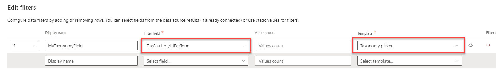

To help you to get started with the countless combinations you can have with the MDV solution, we provide you some prebuilt scenarios and how-tos. 

Tutorials provide complete step-by-step confgurations for common enteprise secenarios and "how-to" format focuses on specific needed configurations for a granular, particular use case

:arrow_right: **From the aequos team**

| Tutorial | Description |
| ---------------- | ------------------|
| [Build a complete search center](./build_complete_search_center.md) | Learn how to build a complete custom search center leveraging all components from MDV 
| [Build a people directory using alphabetical verticals, SharePoint Search data source and adaptive expressions](./build_people_directory_graph.md) | Learn how to build a people directory for your organization usin Microsoft Graph.
| [Build a people directory using alphabetical verticals and SharePoint Search data source](./build_people_directory_sharepoint_search.md) | Same as above but using SharePoint search data source.
| [Build a teams search app using aequos MDV, Microsoft Graph extensions, and SharePoint taxonomy](./build_teams_search_portal_using_taxonomy.md) | Learn how to build a specific search interface for your Teams using custom metadata.
| [Use taxonomy filters with SharePoint search data source](./static_taxonomy_filters_sharepoint_search.md) | Learn how to use taxonomy based filters with SharePoint search data source.

:arrow_right: **From the PnP community**

You can also refer to [scenarios](https://microsoft-search.github.io/pnp-modern-search/scenarios/) made by the community for the PnP Modern Search v4 solution.   

## How-Tos

??? note "How to: Use the taxonomy picker with OData/SharePoint REST API data source"

    1. Add a 'Data Visualizer' Web Part on the page amd select the **'OData'** data source and then  _SharePoint REST API_

    2. In the **Url** field, use the following query :

    ```
    https://<your_site>/_api/web/Lists/GetByTitle('<yout_list_title>')/Items?&$select=*${if(empty('{filters}'),'',concat("&$filter=", buildOdataFilterCondition(json('{filters}'))))}
    ```

    3. Add a 'Data Filters' Web Part on the page an configure the filters like this using the `TaxCatchAll/IdforTerm`:

    {: .center}