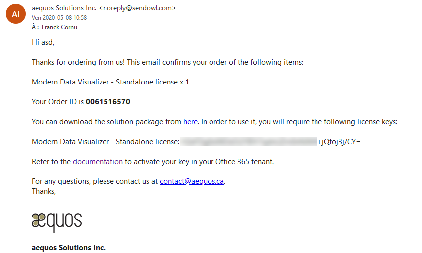

# Setup your standalone license

To setup a standalone license, follow this procedure:

1. On a remote machine that have acces to your Office 365 environment, install [Office 365 CLI](https://pnp.github.io/office365-cli/) as an administrator:

        npm i -g @pnp/office365-cli

2. Connect to Office 365 using the following command and and SharePoint administrator account.

        o365$ login

2. Create a [new tenant property](https://pnp.github.io/office365-cli/cmd/spo/storageentity/storageentity-set/) named `AEQUOS_DATAVISUALIZER_LICENSE_KEY` with, as value, the key you received by email after your purchase:
        {: .center}

        spo storageentity set -k AEQUOS_DATAVISUALIZER_LICENSE_KEY -v <your_key> -d 'aequos Data Visualizer solution license key' -u https://contoso.sharepoint.com/sites/appcatalog

    > In the URL, you must specify the address of the global app catalog in your tenant. If you don't have an app catalog, follow this [procedure](https://docs.microsoft.com/en-us/sharepoint/use-app-catalog) to create one.

2. To remove an existing key, use the following command:

        spo storageentity remove -k AEQUOS_DATAVISUALIZER_LICENSE_KEY -u https://contoso.sharepoint.com/sites/appcatalog

> With a standalone license, **our license validation check endpoint won't be hit**. The validation is done in-place.