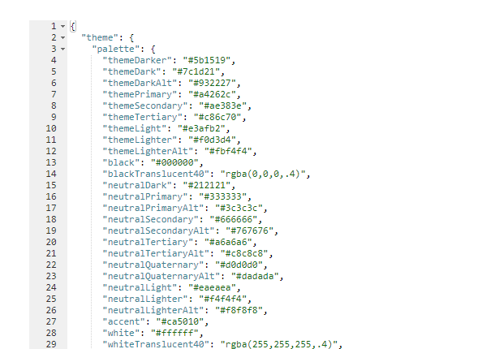
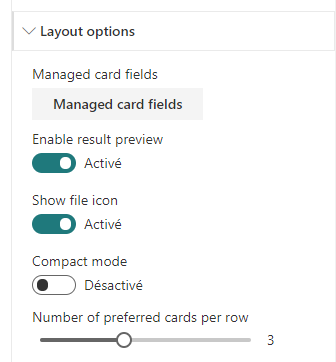

# Browsers compatibility

This solution has been tested on the following browsers:

- Chrome
- Internet Explorer 11
- Firefox
- Opera
- Safari

TODO test versions

# Use SharePoint theme in your templates

If you need to use current site theme colors, fonts and so on you can use the `theme` property available in the root Handlebars context like this:

```
<content id="data-content">

        <style>
            .example-themePrimary {
                color: {{@root.theme.palette.themePrimary}};
            }
            ...
        </styles>

        ...

        <span class="example-themePrimary">{{Title}}</span>

        ...

</content>
```

For the cards and details list layouts, une the `@theme` context property instead:


A good way to see all available values for the current theme is to switch to the debug layout and inspect these values:



# Work with placeholders

To indicate the data are loading, you can create placeholders (shimmers) using the `<content id="placeholder-content">` section of your HTML template:
The placeholder is only loaded during first data load. For subsequent requests, a overlay will be displayed.

```
<content id="placeholder-content">

    <style>

        .placeholder .icon {
            width: 20px;
            height: 16px;
            margin-right: 5px;
        }

        .placeholder ul {
            list-style: none;
        }

        .placeholder ul li {
            display: flex;
            align-items: center;
            padding: 8px;
        }
            
    </style>

    <div class="placeholder">
        <ul>
            {{#times 5}}   
                <li>
                    <div class="icon placeholder--shimmer"></div>
                    <span class="placeholder--shimmer placeholder--line" style="width: 60%"></span>                
                </li>
            {{/times}}
        </ul>
    </div>
</content>
```

Use CSS classes `placeholder--shimmer` and `placeholder--line` to build your placeholders. Basically, you can reuse the same HTML structure as your template content markup, but using these these classes instead to fill areas.

If no placeholder is present in the template, a default one will be loaded.

# Cards layout

The cards layout provides the following options:




| Option | Description
| ------ | ---------------
| **Manage card fields** | Allows you to define you own values for card placeholder fields. By default, the document card fields come with predefined mappings but you can set your own.<br><p align="center"></p>As a field value, you can choose either an item property value from the list (available properties are all the fields returned by the current selected source across all items) without any transformation or use an Handlebars expression by clicking on the checkbox next to it. In this case, all helpers from the main template are available. Also, if the field doesn't have the **'Allow HTML'** indication flag enabled, it means the value will be always interpreted as text, whatever if you set an HTML value. Otherwise, your value will be interpreted as HTML for those fields (ex: '_Location_' and '_Tags_' placeholder fields). For HTML fields you can use the special variable `@theme` to use theme colors (ex: `@them.palette.themePrimary`). If you don't set a value for those fields (i.e an empty value), they won't appear in the UI:<br><p align="center"></p>
| **Enable result preview** | If enabled, displays a preview callout when the  card image is clicked. This will works for office documents, pdf and Office 365 videos.
| **Show file icon** | Hide or display the file icon in the card.
| **Compact mode** | Display the cards in compact mode.
| **Numbre of preferred cards per row** | Try to displays the selected number of cards in the current section. Because a card has a mininum width, the layout will always try to fit the maximum of cards inside the current Web Part section until reaching the layout option value you set. For example, if you specified five cards in a row but the Web Part is rendered in a single vertical section, only one card per row will be displayed regardless the option value. However, if you expand the Web Part in a full width column, the five cards per row will be displayed. This behavior ensures the layout will always render nicely in responsive scenarios.

# Details List Layout

When you enable sorting for a column, the sort is performed on the **initial item fiel value**, not on the Handlebars expression if provided.

If this option is checked, you can choose the item field to use to determine the right icon for instance (`.docx`).

# Work with result types

A result types feature is available for List, Cards and Custom layouts. If you need to apply conditional result in the slider component, use direct conditions like {{#if}} inside the slider component.