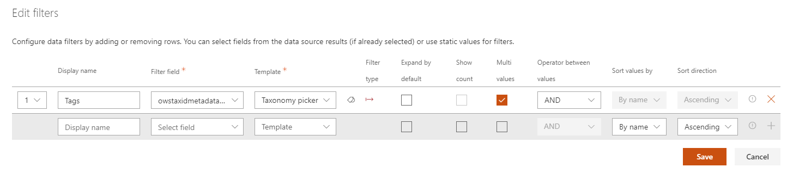
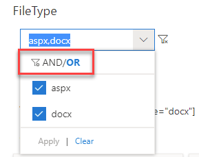
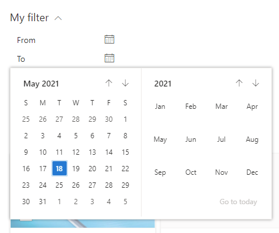
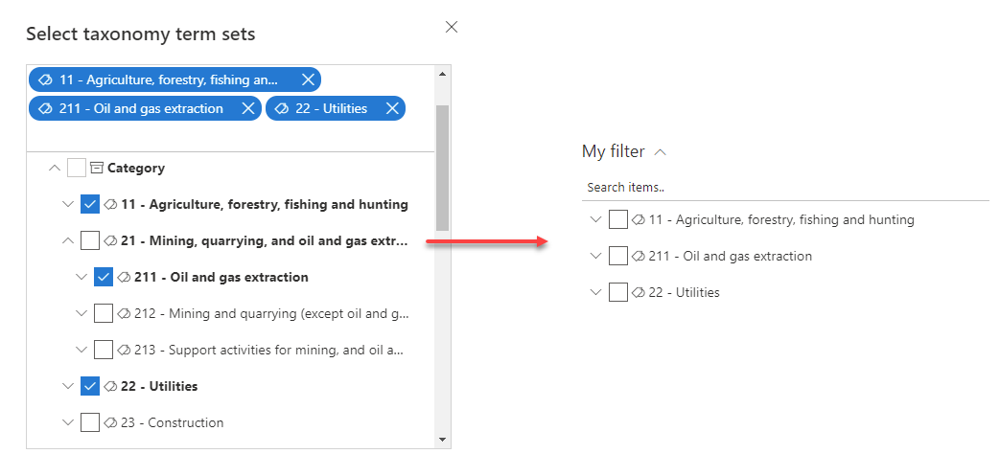
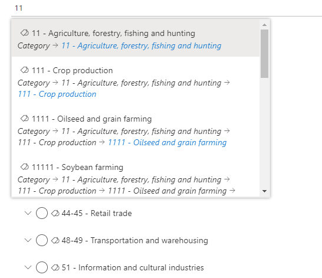

# Data Filters Web Part

The 'Data Filters' Web Part allows to filter the current results displayed in a 'Data Visualizer' Web Part. This component is higly configurable to meet you requirements and it works for all data sources.

{: .center}

{: .center}

## Configuration

### Connection

To use the data filters, we must first connect it to one or multiple 'Data Visualizer' Web Parts. In the other hand, you must conenct back those Web Parts to the 'Data Filters' one. It is a **two-ways connection**.

{: .center} 

!!! note
    If you connect more than one Data Visualizer Web Part, the filter values and counts will be merged for similar filter names:

    **Example**

    **DataSource1** and **DataSource2** expose respectively a _'FileType'_ filter with values and counts `value1 (1)`, `value2 (1)` for **DataSource1** and `value2 (1)`, `value4 (1)` for **DataSource2** and both are connected to the Data Filter Web Part. In this case, an unique _'FileType'_ filter name will be displayed (because the filter name is the same for both data sources) with values `value1 (1)`,`value2 (2)`,`value4 (1)`. If you select a value that is not present in a data source (ex: `value1` for **DataSource2**), you will simply get zero result in the Web Part.

### Filter settings

From the filter settings, you can customize individual filters and the operator to use between filters (**OR** or **AND**).

{: .center}

For each filter, the available options are as follow:

{: .center} 

| **Setting** | **Description** |
|------------|-----------------|
| **Display Name** | A friendly name for the filter. |
| **Filter field** | The internal data source field to use as filter. Here you can select a field from the current data source (if data have been already retrieved) of type your own custom value (press enter to validate).
| **Values count** | The maximum number of values to be retrieved for a given filter. If left empty, the values count will be **defaulted to 10**
| **Template** | The template to use to display filter values. See [Filter templates](#filter-templates) for more details.
| **Filter type** | Specify if the filter is a 'static' filter or a 'refiner' filter. See [Filter types](#filter-types) for more information.
| **Expand by default** | If applicable for the selected template, display values as expanded.
| **Show count** | If applicable for the selected template, display counts for values.
| **Mutli values** | If applicable for the selected template, allow selection of multiple values.
| **Operator between values** | If multi values is selected, the operator to use between values (**OR**/**AND**). This value can be overriden manually by the user when using the following filter templates:  <ul><li>Checkbox</li><li>Combo box</li><li>Taxonomy picker</li></ul>   {: .center} 
| **Sort values by** | Sort values by name or by count.
| **Sort direction** | Sort values in ascending/descending order.

### <a name=filter-templates>Filter templates</a>

The available filter templates are as follow:

| **Template** | **Overview** |
|------------|-----------------|
| **Checkbox** | Filter results as flat list of values.   
| **Date interval** | Filter results according to predefined date intervals (any time, last month, last 3 months, last year and older than a year. **These intevals can't be changed**.   
| **Date range** | Filter values from/to a start/end date.   
| **Combo box** | Filter results as a dropdown list of values.   
| **Taxonomy picker**   ([Configuration details](#taxonomy-picker-configuration)) | Filter results using a SharePoint taxonomy hierarchy of terms. For more information about taxonomy picker configuration, click [here](#taxonomy-picker-configuration).   

#### <a name=taxonomy-picker-configuration>Taxonomy Picker template configuration</a>

The taxonomy picker template allows you to filter data using the SharePoint Term Store using your own information architecture.

{: .center} 

## Configure the taxonomy picker

To configure the taxonomyp picker, follow these steps:

1. From the Data Filter Web Part **'Edit'** button in the Web Part property pane, select the _Taxonomy picker_ template from the dropdown list and click on the tag icon next to it to view setings:

    {: .center} 

1. Select anchor terms or term sets you want to display as filters for users. They will be displayed as root elements for the filter name in the Web Part. You have here the flexibility to mix term sets from different term groups or anchor terms from same or different term sets:

    **Example with term sets:**

    {: .center}

    **Example with anchor terms**

    {: .center} 

    !!! note

        - Even though there is no technical limitation regarding the number of anchor terms or term sets you can display as root filters, we strongly recommend to limit this number to only few items to avoid performance issues or split into multiple filters.

        - Only items with the same type can be used as root filters (i.e. only term sets or terms, not both at the the time).

3. Configure behavior settings with the provided options:

    {: .center} 

    | **Setting** | **Description** |
    |------------|-----------------|
    | **Item selection behavior** | Determine the default selection behavior when a user select the value. This settings can also be overriden per value for more flexibility:    {: .center} |
    | **Number of items per page** | Determine the number of items to show per taxonomy levels. An high value will have impact on performances.    {: .center} |
    | **Display search box** | Determine if a search box should appear in the picker letting users search for values. When an user search for values, the scope is restricted to term sets or anchor terms configured as root and does not apply to the whole term store. Also, the search is performed **using the current UI language**.    {: .center} |

## <a name=filter-types>Filter types: 'Static' filter versus 'Refiner' filter</a>

The Web Part supports two types of filters (_'Static'_ and _'Refiner'_). However, there are some differences that are important to understand between these two if you want to use them properly:

- **Refiner**: a 'Refiner' filter means the filter gets its values from the data source and sends back the selected ones the data source. If the data source has no result, there won't be any refiner values, simple as that.
- **Static filter**: a 'Static' filter means the filter doesn't care about filter values sent by the data source and provides its own arbitrary values regardless of input values. A date range picker or a taxonomy picker (or any picker) are good examples of what an 'Static' filter is. Such a filter do not need necessarily need a Data Visualizer connection.

!!! note
    The filter type is indicated for each filter. 
    

## Use indexed property bag properties with taxonomny values

> **This behavior only works with the SharePoint Search Data source and the _Enabled localization_ flag activated.**

Using an indexed property bag value could be useful to store information about a SharePoint site or other element that can't be tagged with a taxonomy value directly. The _'Modern Data Visualizer'_ solution supports property bag properties values that use the following taxonomy value format to be able to filter on them (ex: a taxonomy multi values separated by a semicolon (;)):

`L0|#a2cf1afb-44b6-4cf4-bf37-642bb2e9bff3|Category 1;L0|#02e3406c0-1048-4bce-90eb-e7a51dfa7f31|Category3;L0|#07e094327-23d7-48af-9699-781eb26dc40f|Category2`

These taxonomy values can then be used in the Data Filters Web Part using a `RefinableStringXX` search managed property to filter specific sites or elements. As an example, you can refer to the ["Create an end-to-end Office 365 groups provisioning solution"](https://github.com/pnp/tutorial-workspace-provisioning) tutorial GitHub project to leverage this format.

