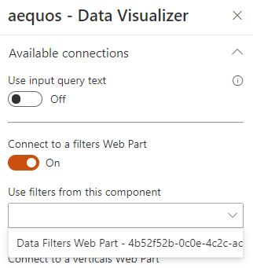

# Connections

The 'Data Visualizer' Web Part can be used alone but also connected to other Web Parts:

{: .center}

## Input query text

The input query text can be either static or dynamic. In all case, this value can be used using the `{inputQueryText}` token. See [tokens](../tokens.md) for more information.

**Static value**

It corresponds to a free text keyrwors that you want to pass to your data source:

{: .center}

**Dynamic value**

You can connect a dynamic value from the page environment (ex: a query string parameter, the top bar search box, etc.) or a search box already added to the page.

{: .center}

## Filters Web Part

For static filters (i.e. taxonomy picker and date range filter templates), this value can be used using the `{filters.<FilterName>}` token. See [tokens](../tokens.md) for more information.

{: .center}

## Verticals

{: .center}

When you connect the Web Part to a Data Verticals one, you must specify on which vertical the Web Part content should be displayed.

{: .center}

This mechanism allows to build a complete search center using verticals tabs. 