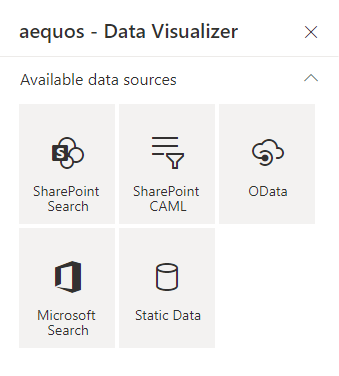

# Data sources

## Builtin data sources

By default, the following data sources are provided:

{: .center}

> Be careful, when you switch the data source in the property pane, all the previous data source properties are lost. We do this to avoid polluting the Web Part property bag with multiple useless configurations.

### SharePoint Search

{!usage/data-visualizer/data-sources/sharepoint-search.md!}

### SharePoint CAML

{!usage/data-visualizer/data-sources/sharepoint-caml.md!}

### OData

{!usage/data-visualizer/data-sources/odata.md!}

### Static Data

{!usage/data-visualizer/data-sources/static-data.md!}

### Microsoft Search

{!usage/data-visualizer/data-sources/microsoft-search.md!}

## Common settings

{!usage/data-visualizer/common/common.md!}

## Paging

{!usage/data-visualizer/common/paging.md!}

## Caching

{!usage/data-visualizer/common/caching.md!}

