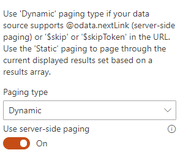

The OData data source allows you to get data from the following APIs

- **Microsoft Graph**: both [v1.0](https://docs.microsoft.com/en-us/graph/api/overview?view=graph-rest-1.0) or [beta](https://docs.microsoft.com/en-us/graph/api/overview?view=graph-rest-beta) endpoints.
- **SharePoint REST API**: the current site or an other site in your tenant. Supports [v1.0](https://docs.microsoft.com/en-us/sharepoint/dev/sp-add-ins/get-to-know-the-sharepoint-rest-service) or [v2.0](https://docs.microsoft.com/en-us/sharepoint/dev/apis/sharepoint-rest-graph),
- **Azure Active Directoy secured API** like an Azure function, Azure Web Application, etc.
- **Anonymous API**

    {: .center}

#### Microsoft Graph

The URL supports the following formats. Tokens can also be used to construct your URL:

* `me`
* `/me`
* `https://graph.microsoft.com/v1.0/me`
* `https://graph.microsoft.com/beta/me`
* `me/events?$filter=startswith(subject, 'ship')`

> Before using a Microsoft Graph resource, you need to ensure [you allowed the correct API permissions at tenant level](https://docs.microsoft.com/en-us/sharepoint/dev/spfx/use-aadhttpclient). Because you can't define API permissions through the Web Part package declaratively (i.e `webApiPermissions`), we recommend you to use the [CLI for Microsoft 365](https://pnp.github.io/cli-microsoft365/cmd/spo/serviceprincipal/serviceprincipal-grant-add/) to add correct permissions for your API:

```bash
m365 spo serviceprincipal grant add --resource 'Microsoft Graph' --scope 'Mail.Read'
```

#### SharePoint REST API

The URL supports the following formats. Tokens can also be used to construct your URL

* `/_api/` (will target the current root site if you don't specify anything)
* `<your_site>/_api/` (ex: http://mycompany.sharepoint.com/sites/intranet/_api/lists)
* `/_api/v2.0/sites/{site.id}/drive/list/items?expand=fields(select=FileLeafRef,BaseName,FileRef,FSObjType)&$top={itemsCountPerPage}`
* etc.

> You can also use [query parameters supported by the API](https://docs.microsoft.com/en-us/sharepoint/dev/sp-add-ins/use-odata-query-operations-in-sharepoint-rest-requests)


#### Azure Active Directory secured API

1. Follow this [procedure](https://docs.microsoft.com/en-us/sharepoint/dev/spfx/use-aadhttpclient#connect-to-azure-ad-applications-using-the-aadhttpclient) to set up your Azure Active Directory application. Don't forget to add at least the '_user impersonation_' permission to be able to call the API endpoint.

    > Before using an AAD secured resource, you need to ensure [you allowed the correct API permissions at tenant level](https://docs.microsoft.com/en-us/sharepoint/dev/spfx/use-aadhttpclient). Because you can't define API permissions through the Web Part package declaratively (i.e `webApiPermissions`), we recommend you to use the [CLI for Microsoft 365](https://pnp.github.io/cli-microsoft365/cmd/spo/serviceprincipal/serviceprincipal-grant-add/) to add correct permissions for your API:

    ```bash
    m365 spo serviceprincipal grant add --resource '<aad_app_display_name>' --scope 'user_impersonation'
    ```

2. Allow your SharePoint domain (ex: https://mycompany.sharepoint.com) as allowed origin in the service or application CORS (Cross-origin resource sharing) settings. Here a procedure for an [Azure function](https://docs.microsoft.com/en-us/azure/azure-functions/functions-how-to-use-azure-function-app-settings).

#### Anonymous

You can also call an API endpoint with no specific authentifcation like an Azure HTTP trigger Function with function code. By default, we use the demo OData v4 services provided by [https://www.odata.org/odata-services/](https://www.odata.org/odata-services/) to demonstrate the capability.

##### Set HTTP headers or body

The only method allowed are `GET` or `POST`. For each, you have the ability so set your own HTTP headers. **The value must be a valid JSON value**:

```json
{
    "Content-Type": "application/json;odata=verbose",
    "Accept": "application/json",
    ...
}
```

> If you specify a `POST` request, you can also benefit of [builtin tokens](../tokens.md).

```json
{
    "ItemsCount": "{itemsCountPerPage}",
    "MyProperty": "My Value",
    ...
}
```

| **Sort settings** | Configure the sort settings of the data source. The sort property should be entered manually in the Sort Field. For a particular field, you can define if it should be used for initial sort (i.e. when the results are loaded for the first time) or be only available for users in the sort control (i.e. after the results are loaded). **The sort control does not consider default sort fields (i.e. select them by default) and you can only sort on a single field at a time according the fields you defined**. If no user sort fields are defined in the configuration, the sort control won't be displayed. The Sort will only work with APIs that use "orderby" as the property for sorting. With SharePoint and Microsoft APIs, it will always work as they use "orderby" for sorting.| None.
#### Pagination

For each API type, you can control how the results will be paginated in order to improve performances.

{: .center}


##### Dynamic paging

Use a **Dynamic** paging if the underlying API you are using supports paging mechanisms (likely using `$top` and `$skip` or `$skipToken` tokens, for instance Microsoft Graph or SharePoint REST API).

###### Use server-side paging

Some APIs like Microsoft Graph or the SharePoint REST API provide a server-side paging functionality (see https://docs.microsoft.com/en-us/graph/paging for more information). Basically, it allows you to paginate results more easily by using a pre-calculated next page link URL instead of building it manually. 

If checked, the paging will be based on the `@odata.nextLink` value from the HTTP response. It means when you will click on the next page button, **this value** will be used to get the next set of results. Thus, the items count and paging information (i.e first page, current page, next page, previous page, and last page) will be determined automatically as long as you move through pages.

If unchecked, it will be **your URL** to be executed to get the next page results. In this last scenario you likely want to provide a dynamic URL using builtin _tokens_.

**Example**

- With server-side paging enabled using `@odata.nextLink`:

        /me/messages?$top={itemsCountPerPage}
        or
        /me/messages?$top=2

    Here, the `$skip` token will be provided automatically in the `@odata.nextLink` so you don't have to provide it in the URL.

- Without server-side paging enabled using `$top` and `$skip` tokens:

        <your_sharepoint_site_url>/_api/lists?$top={itemsCountPerPage}&$skip={startRow}

    If you want to control the paging by yourself, you will have to provide a `$skip` value manually using builtin tokens. You can use the `{itemsCountPerPage}` and `{startRow}` [tokens](../tokens.md) where `{startRow}` corresponds to the number or items per page * the current page number (start from 0) and `{itemsCountPerPage}` to the number of items per page configured in the property pane. The URL and the items count will be resolved dynamically based on these token values as long as you move through pages. Because we can't determine the total number of items, in some cases, the last page could be empty. It happens for example when the 'total items count'/'items count per page' is even (i.e. exact same number of items for each page).

##### Static paging

If performance is not an issue (i.e for a small ammount of data), you can also set a static paging on your data based on a results array. In this case, you will have to provide the response field to use as the array of items to get the total items count. Then, in the common paging settings, configure the desired number items per page to generate pages dynamically.

{: .center}

> If you use static paging, don't forget to add a fixed count in your url `/me/messages?$top=10` instead of `/me/messages?$top={itemsCountPerPage}`. Otherwise, you will get only one page every time.

