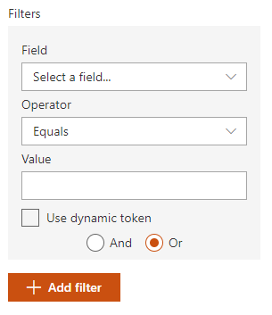

The _'SharePoint CAML'_ data source allows you to rerieve items uisng a CAML query built using the interative builder or using an XML text.

#### Source configuration

A CAML query always apply on a SharePoint list or document library. Thus, you must first select one using the following dropdowns:

{: .center}

| Setting | Description | Default value |
| ------- |---------------- | ---------- |
| **Site** | The site collection containing the list or document library | By default, it uses the current site collection. However, you can disable the checkmark and search for a specific site. This control uses SharePoint search to get sites looking in the _Title_ and _Path_ managed properties. It means if your sites has been newly created it may not appear immediatly until indexed. | Current site collection.
| **Web** | The web containing the list. It can be the root web of the selected site collecion or an other subsite. | '/' (root web)
| **List** | The list where the CAML query will be applied. | None

#### CAML Query configuration

To build your CAML query, you have the choice to use the interactive builder or start from scratch using your own XML. See the [query schema for CAML](https://docs.microsoft.com/en-us/sharepoint/dev/schema/query-schema) to get started.

##### Using the builder

| Setting | Description | Default value |
| ------- |---------------- | ---------- |
| **View Fields** | The item fields to return from the. They will be available in your templates with the same name. | <ul><li>UniqueId</li><li>EncodedAbsUrl</li><li>FileRef</li><li>File_x0020_Type</li><li>FileLeafRef</li><li>Name</li><li>Author</li><li>Created</li></ul>
| **Search within folders** | Enable this option if you want to search in folders recursively in your list or document library. | False
| **Filters** | The filter condition builder. From here you can select:  

 <ul><li><b>Field</b>: the list to apply the condition</li><li><b>Operator</b>: the operator to use. Supported operators are _"Equals,Does not equal, Is greater than, Is less than, Is grater or equal to, Is less or equal to, Is null, Is not null, Begins with and Contains"_.**Operator choices are automatically adjusted regarding the selected field type.**</li><li><b>Value</b>: the value to use for the condition. You can use a plain text/date/taxonomy value here (depending of the selected field type) or use a dynamic token. For the second option, enable the corresponding checkbox to have access to the dynamic tokens menu. Notice that not all available tokens are listed here. If the token you want to use is not is the list, you can add it using the _'Custom value'_ option and press enter. All supported tokens can be found [here](../tokens.md)</li></ul>
| **Sort** | Configure the sort settings of the data source. The sort property can be selected from the dropdown. For a particular field, you can define if it should be used for initial sort (i.e. when the results are loaded for the first time) or be only available for users in the sort control (i.e. after the results are loaded). **The sort control does not consider default sort fields (i.e. select them by default) and you can only sort on a single field at a time according the fields you defined**. If no user sort fields are defined in the configuration, the sort control won't be displayed.  | None.

##### Using the advanced mode

In advanced mode, you are responsible to wrtie your own CAML query as XML text. You can use tokens `{<tokenName>}` directly in the text to create dynamic queries.

{: .center}

> Tip: to help you get started, you can start writing your query using the builder and then switch to 'Advanced mode'. This way, you will see the underlying generated query. However, **from the moment where the CAML query text in advanced mode differ from the one generated by the builder, the builder settings will be lost if you switch back to that mode**.

