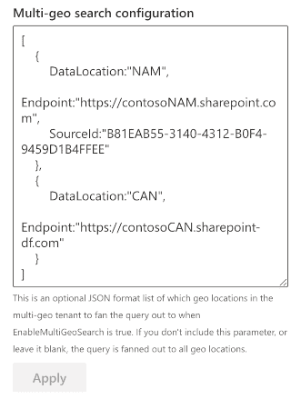

The _'SharePoint Search'_ data source retrieve items from the SharePoint search engine.

> The SharePoint search is different from the Microsoft Graph search.

#### Source configuration

| Setting | Description | Default value 
| ------- |---------------- | ---------- |
| **Query text** | The input query text to pass to the search engine. This setting is not configurable directly in the data source options. To enable it you use go the the third configuration page of the Web Part and selected either a static or dynamic value (Ex: from a connected search box Web Part). See [the connection documentation](#) for more information on how to configure this option. This value can be then used in the **Query template** using the `{searchTerms}` token. Also this value can be a [Keyword Query Language expression (KQL)](https://docs.microsoft.com/en-us/sharepoint/dev/general-development/keyword-query-language-kql-syntax-reference). | None
| **Query template** | The search query template to use. It allows you to use dynamic tokens according to the context or specifiy conditions that should always apply to the query. | `{searchTerms}`
| **Result source ID** | Can be either a built-in result source ID listed in the dropdown, or a custom result source that you specify. Type the `GUID` of the result source, or the `SCOPE` (Level - [SearchObjectLevel enumeration](https://docs.microsoft.com/en-us/previous-versions/office/sharepoint-csom/jj262300(v=office.15)?redirectedfrom=MSDN)) and `NAME` (SourceName), separated by `|` (pipe character). For this to take effect, you must press _'Enter'_ to save the value. Valid scopes are `SPSiteSubscription`, `SPSite`, `SPWeb`. Examples: <ul><li>SPWeb`|`Local News</li><li>SPSite`|`Contracts</li><li>SPSiteSubscription`|`Intranet</li></ul> | LocalSharePointResults
| **Selected properties** | The SharePoint managed properties to retrieve from the results. They can be used with the same name in layouts and slots afterwards. | <ul><li>Title</li><li>Path</li><li>DefaultEncodingURL</li><li>FileType</li><li>HitHighlightedSummary</li><li>AuthorOWSUSER</li><li>owstaxidmetadataalltagsinfo</li><li>Created</li><li>UniqueID</li><li>NormSiteID</li><li>NormListID</li><li>NormUniqueID</li><li>ContentTypeId</li><li>UserName</li><li>JobTitle</li><li>WorkPhone</ul>
| **Sort settings** | Configure the sort settings of the data source. Properties listed in the dropdown are all static properties marked as _'Sortable'_ in the [SharePoint search schema](https://docs.microsoft.com/sharepoint/technical-reference/). However, it does not list all possible _RefinableXXX_ or aliases fields. To use them, you must enter the value manually and press 'Enter' to validate. For a particular field, you can define if it should be used for initial sort (i.e. when the results are loaded for the first time) or be only available for users in the sort control (i.e. after the results are loaded). **The sort control does not consider default sort fields (i.e. select them by default) and you can only sort on a single field at a time according the fields you defined**. If no user sort fields are defined in the configuration, the sort control won't be displayed.  | None.
| **Refinement filters** | The initial refinement filters to apply to the query. Both KQL (Keyword Query Language) and FQL ([Fast Query Language](https://docs.microsoft.com/en-us/sharepoint/dev/general-development/fast-query-language-fql-syntax-reference)) expressions work here (Ex: KQL `FileType:docx`, FQL: `FileType:equals("docx")`). They will be apply every time to the current search query regarless selected filters from connected Web Parts. Notice: for strign expressions, use `"` isntead of `'`. | None
| **Language of the search request** | The language to use for the search request. By default the search request will be made using the current user interface language. This parameter is mainly use to process diacritics, plurals, etc. correctly according to the language. | Current UI language.
| **Enable query rules** | Whether or not apply SharePoint query rules. | False
| **Include OneDrive for Business results** | Whether or not include OneDrive for business results. | False
| **Enable audience targeting** | Whether or not results should be targeted according to the audiences that the current user belongs to. [More information about modern audiences and how to configure them](https://support.microsoft.com/en-us/office/target-navigation-news-and-files-to-specific-audiences-33d84cb6-14ed-4e53-a426-74c38ea32293). | False
| **Enable localization** | If enabled, the Web Part will try to translate the taxonomy term IDs found in result item properties and refinement values to their corresponding label according to the curent UI language. To get it work, you must map a new refinable managed property associated with ows_taxId_ crawled property and turn this toggle 'on':  If enabled and depending how many items are currently displayed, this could be slightly decrease loading performances.   **To use translated values in your template, you must use the '`Auto + <property_name>`' property format instead of the original property name**. For instance, to use translated values of the '_owstaxidmetadataalltagsinfo_' property, you must use the '<b>Auto</b>owstaxidmetadataalltagsinfo' auto created property.   | False
| **Enable multi-geo environment** | If your organization expands its Microsoft 365 presence to multiple geographic regions and/or countries within your existing tenant, you can enable it. Once enabled, the Web Part will include the geo-locations configuration; you can specify an optional list of which geo-locations in the multi-geo tenant to fan the query out. If you don't include this parameter or leave it blank, the query is fanned out to all geo locations. [More information about the Search configuration for Microsoft 365 Multi-Geo](https://docs.microsoft.com/en-us/microsoft-365/enterprise/configure-search-for-multi-geo?view=o365-worldwide). | False

