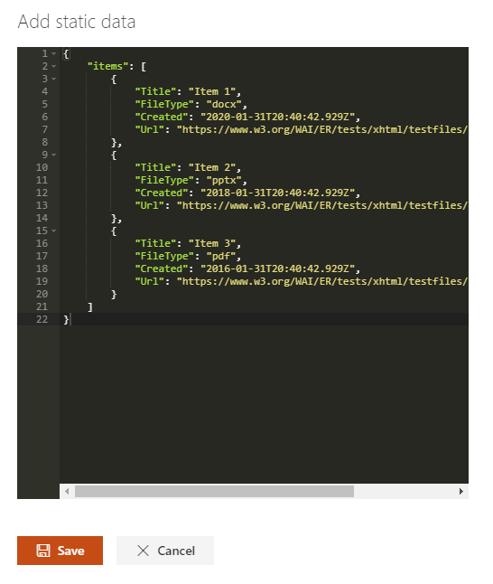
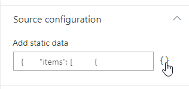

The _'Static data'_ is the simplest data source you can use. With this data ssource, items are retrieved from a static JSON object that you define and does not require any asynchronous call.

{: .center}

#### When to use this data source?

This data source allows you to define your own data schema (i.e. fields) that you can consume in your template. However, to be consumed by templates, the data must follow this JSON strcuture: 

```json
{
    "items": [
        {
            "<any_property>": "<any_value_of_any_type>",
            ...
        }
    ],
    "<any_other_property>": "<any_value_of_any_type>",
    ...
}
```

> Don't forget the quotes '"' for property names.

> Even if you don't return items, you must specifiy this property. In this case, pass an empty array.

#### How to use this data source: a practical example

Let say you want to display a static list of useful links for your organization on the home page. Open the code editor and enter the following data:

{: .center}

The data could be look like this:

```json
{
    "items": [
        {
            "linkName": "My Company Web Site",
            "linkHref": "http://mycompany.com",
            "linkOpenBehavior": "_blank"
        },
        {
            "linkName": "My Company Web Site",
            "linkHref": "http://mycompany.com",
            "linkOpenBehavior": "_blank"
        }
    ],
    "numberOfLinks": "2"
}
```

Now to consume this data, you can either start from an existing layout, or use a custom one. See the [templating documentation](../../../extensibility/templating.md) to know more.