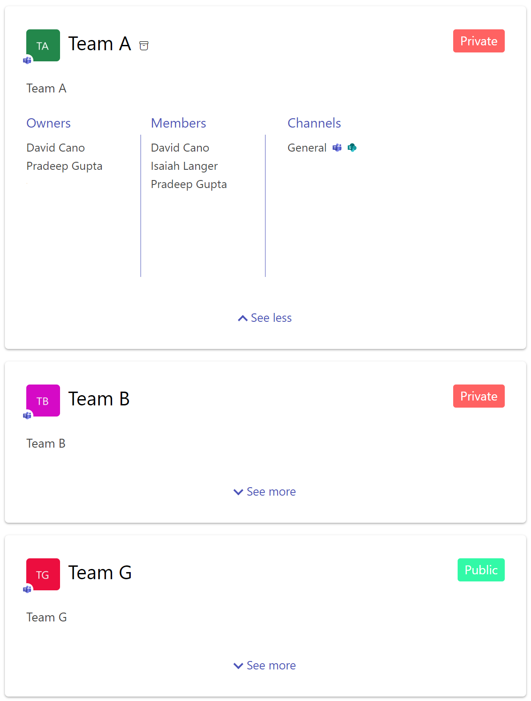
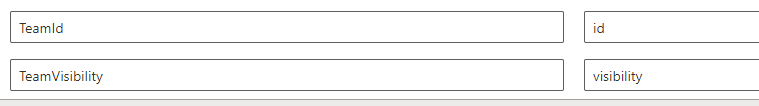
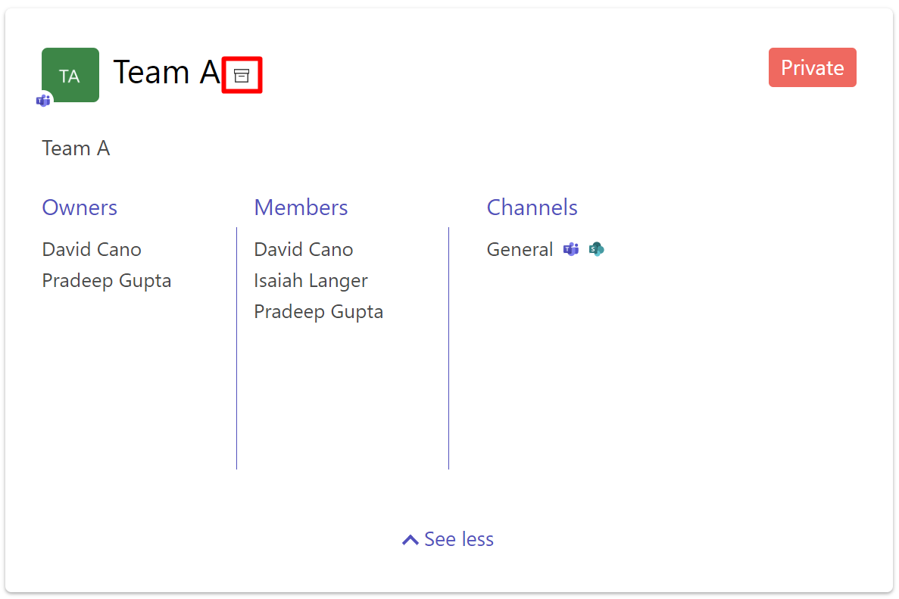

The **Teams** layout can be used to display information about Microsoft Teams teams and Microsoft 365 groups:

{: .center .img-width}

| Setting | Description | Default value 
| ------- |---------------- | ---------- |
| Data source fields | The data source to display as tags. The order you select fields will determine the display order.<br />{: .center} <br /> This option can be usefull if, for instance, you set custom [Microsoft schema extensions on your Microsoft 365 groups](https://docs.microsoft.com/en-us/graph/extensibility-schema-groups)  | None

Despite you can use this layout with any data, the 'teams' layout is firstly designed to be paired with a data source retrieving these relevant informations. That's why we suggest to use this layout and the [**OData & Microsoft Graph**](../data-sources/odata.md) data source with the following Microsoft Graph URLs and configurations:

!!! example "Only teams where the current user is a member"
	=== "URL"

		`https://graph.microsoft.com/beta/me/memberOf/$/microsoft.graph.group?$top={itemsCountPerPage}&$count=true&$select=id,displayName,description,visibility&$filter=resourceProvisioningOptions/Any(x:x eq 'Team')`

	=== "HTTP Headers"
		```json
		{
			"Content-Type": "application/json;odata=verbose",
			"Accept": "application/json",
			"ConsistencyLevel": "eventual"
		}
		```

	=== "Permissions"
		- _User.Read_
		- _GroupMember.Read.All_ (to list owners and members in the team panel)
		- _Channel.ReadBasic.All_ (to list channels in the team panel)

!!! example "All Microsoft 365 groups (with or without Teams, public/private)"
	=== "URL"

		`https://graph.microsoft.com/v1.0/groups`

	=== "HTTP Headers"
		```json
		{
			"Content-Type": "application/json;odata=verbose",
			"Accept": "application/json",
			{
				"ConsistencyLevel": "eventual"
			}
		}
		```

	=== "Permissions"
		- _GroupRead.All_
		- _GroupMember.Read.All_ (to list owners and members in the team panel)
		- _Channel.ReadBasic.All_ (to list channels in the team panel)


These URLs can also be enhanced using adaptive expressions to build a dynamic query depending the context (ex: selected filters, search box keywords, etc.). 

!!! example "Groups with a display name or description that contains with a keyword from the search box including a count of returned objects"
	=== "URL"

		`https://graph.microsoft.com/v1.0/groups?${if(empty("{inputQueryText}"),'','&$search="displayName:{inputQueryText}" OR "description:{inputQueryText}"')}&$count=true&$top={itemsCountPerPage}&$orderby=displayName`

	=== "HTTP Headers"
		```json
		{
			"Content-Type": "application/json;odata=verbose",
			"Accept": "application/json",
			"ConsistencyLevel": "eventual"
		}
		```
	=== "Permissions"
		- _GroupRead.All_
		- _GroupMember.Read.All_ (to list owners and members in the team panel)
		- _Channel.ReadBasic.All_ (to list channels in the team panel)		

See also the ["Build a teams search app using aequos MDV, Microsoft Graph extensions and SharePoint taxonomy"]() on how you can leverage this capability with SharePoint taxonomy filters.

!!! important ""
    This URL require the `"ConsistencyLevel": "eventual"` HTTP header to be set in the **OData** data source configuration:

    {: .center}

This layout uses the following data source slots by defaut:

{: .center}

| Setting | Description | Default value 
| ------- |---------------- | ---------- |
| `TeamId` | The Microsoft 365 or Microsoft Teams team id. This information is used by the layout to get additional information about the team (ex: channels, member, owners)  | `id`
| `TeamVisibility` | The team visiblity (public/private). Leave this field empty if you don't want to display visibility | `visiblity`

This layout displays now the information about archive status of a Team. The information is visible with this icon {: .icon}

{: .center .img-width}